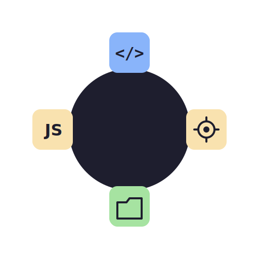

<p align="center">
  
</p>

<h1 align="center">Dywo</h1>

<p align="center">
  A flexible CLI tool for web project management
</p>

<p align="center">
  <a href="https://www.npmjs.com/package/dywo"></a>
  <a href="https://opensource.org/licenses/MIT"></a>
  <a href="https://www.npmjs.com/package/dywo"></a>
  <a href="https://github.com/enclica/dywo-cli/stargazers"></a>
  <a href="https://github.com/enclica/dywo-cli/issues"></a>
  <a href="https://github.com/enclica/dywo-cli/pulls"></a>
</p>

---

**Dywo** is a flexible Command Line Interface (CLI) tool for web project management. It simplifies the process of creating, developing, and managing web projects with a focus on vanilla JavaScript development.

## Features

- Project generation with customizable templates
- Built-in development server
- Compilation and bundling of assets
- Code linting and formatting
- Test runner integration
- JavaScript obfuscation

## Installation

### Option 1: Install from npm

```bash
npm install -g dywo
```

### Option 2: Install from source

1. Clone the repository:
   ```bash
   git clone https://github.com/enclica/dywo-cli.git
   cd dywo-cli
   ```

2. Install dependencies:
   ```bash
   npm install
   ```

3. Link the CLI tool globally:
   ```bash
   npm link
   ```

## Usage

### Generate a new project

```bash
dywo generate
```

Follow the prompts to customize your project.

### Compile your project

```bash
dywo compile client
```

or

```bash
dywo compile server
```

### Serve your project

```bash
dywo serve
```

### Run tests

```bash
dywo test client
```

or

```bash
dywo test server
```

### Lint your code

```bash
dywo lint client
```

### Format your code

```bash
dywo format client --write
```

### Obfuscate your code

```bash
dywo obfuscate client
```

## Configuration

Dywo uses a `dywo.config.js` file in the root of your project for configuration. Here's an example:

```javascript
module.exports = {
  client: {
    entry: './src/main.js',
    output: {
      path: './dist',
      filename: 'bundle.js'
    }
  },
  server: {
    entry: './server/index.js',
    output: {
      path: './dist',
      filename: 'server.js'
    }
  },
  devServer: {
    port: 8080
  }
};
```

## Contributing

Contributions are welcome! Please feel free to submit a Pull Request.

1. Fork the repository
2. Create your feature branch (`git checkout -b feature/AmazingFeature`)
3. Commit your changes (`git commit -m 'Add some AmazingFeature'`)
4. Push to the branch (`git push origin feature/AmazingFeature`)
5. Open a Pull Request

## License

This project is licensed under the MIT License - see the [LICENSE](LICENSE) file for details.

## Support

If you encounter any problems or have any questions, please open an issue on the [GitHub repository](https://github.com/enclica/dywo-cli/issues).

---

Made with ❤️ by [Enclica Software](https://github.com/enclica)
